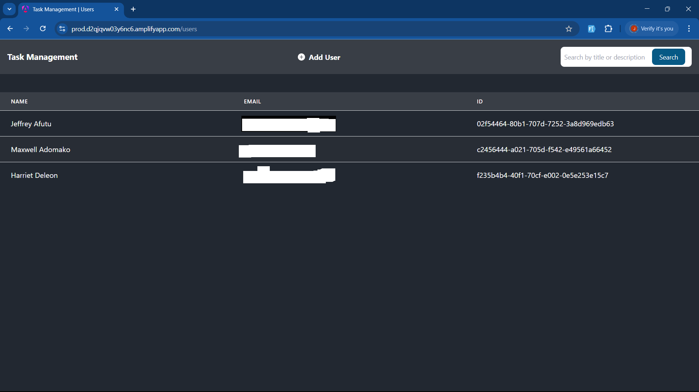

# TASK MANAGEMENT SYSTEM

## OVERVIEW
This is the frontend for a task management system built using Angular. The system allows an administrator to create users and assign tasks to them. Each task has one of three statuses: Open, Completed, and Expired. Administrators can open tasks and set deadlines, while users can mark tasks as completed. Tasks automatically expire once the deadline passes..

## FEATURES
### Admin Functionality:
- Create and manage users.
- Assign tasks to users.
- Set deadlines for tasks.
- View all tasks and their statuses.

### User Functionality:
- View assigned tasks.
- Mark tasks as completed.

### Task Status Management:
- Tasks can be Open, Completed, or Expired.
- Expired status is set automatically when the deadline is reached.

## INSTALLATION AND SETUP
1. Clone the repository
```
git clone https://github.com/Kjeff24/task-management-frontend-application.git
```
2. Install dependencies
```
npm install
```
3. Clone the backend repository for API integration:
```
https://github.com/Kjeff24/task-management-serveless-application.git
```
Follow the backend repository instructions for setup.
4. Create a .env file and provide your values
```
USER_POOL_DOMAIN_URI=
TOKEN_ENDPOINT=
LOGIN_ENDPOINT=
CLIENT_ID=
CLIENT_SECRET=
REDIRECT_URI=
API_GATEWAY=
```
5. Run the application
```
ng serve
```
6. Open your browser and navigate to:
```
http://localhost:4200 
```

## TECHNOLOGIES USED
- Angular (Frontend Framework)
- TypeScript (Programming Language)
- HTML & CSS (UI)

## FOLDER STRUCTURE
```
src/
├── app
│   ├── app.component.css
│   ├── app.component.html
│   ├── app.component.spec.ts
│   ├── app.component.ts
│   ├── app.config.ts
│   ├── app.routes.ts
│   ├── components
│   │   ├── add-comment
│   │   │   ├── add-comment.component.css
│   │   │   ├── add-comment.component.html
│   │   │   ├── add-comment.component.spec.ts
│   │   │   └── add-comment.component.ts
│   │   ├── add-deadline
│   │   │   ├── add-deadline.component.css
│   │   │   ├── add-deadline.component.html
│   │   │   ├── add-deadline.component.spec.ts
│   │   │   └── add-deadline.component.ts
│   │   ├── add-user
│   │   │   ├── add-user.component.css
│   │   │   ├── add-user.component.html
│   │   │   ├── add-user.component.spec.ts
│   │   │   └── add-user.component.ts
│   │   ├── new-task-modal
│   │   │   ├── new-task-modal.component.css
│   │   │   ├── new-task-modal.component.html
│   │   │   ├── new-task-modal.component.spec.ts
│   │   │   └── new-task-modal.component.ts
│   │   └── task-card
│   │       ├── task-card.component.css
│   │       ├── task-card.component.html
│   │       ├── task-card.component.spec.ts
│   │       └── task-card.component.ts
│   ├── guards
│   │   └── admin
│   │       ├── admin.guard.spec.ts
│   │       └── admin.guard.ts
│   ├── models
│   │   ├── message.ts
│   │   ├── task.ts
│   │   ├── token-reponse.ts
│   │   └── user.ts
│   ├── pages
│   │   ├── home
│   │   │   ├── home.component.css
│   │   │   ├── home.component.html
│   │   │   ├── home.component.spec.ts
│   │   │   └── home.component.ts
│   │   └── users
│   │       ├── users.component.css
│   │       ├── users.component.html
│   │       ├── users.component.spec.ts
│   │       └── users.component.ts
│   ├── services
│   │   ├── task-service
│   │   │   ├── task.service.spec.ts
│   │   │   └── task.service.ts
│   │   ├── token
│   │   │   ├── token.service.spec.ts
│   │   │   └── token.service.ts
│   │   └── user-service
│   │       ├── user.service.spec.ts
│   │       └── user.service.ts
│   └── utils
│       ├── date-utils.ts
│       └── validators.ts
├── assets
│   └── svg
│       ├── eye-fill.svg
│       ├── plus-circle-fill.svg
│       └── three-dots-vertical.svg
├── custom-webpack.config.ts
├── environments
│   ├── environment.dev.ts
│   ├── environment.prod.ts
│   └── environment.ts
├── index.html
├── main.ts
└── styles.css
```

## APPLICATION UI
### ADMIN
1. Home

2. Create task

3. View users

4. Add users


### USERS
1. Home

2. Add comment
